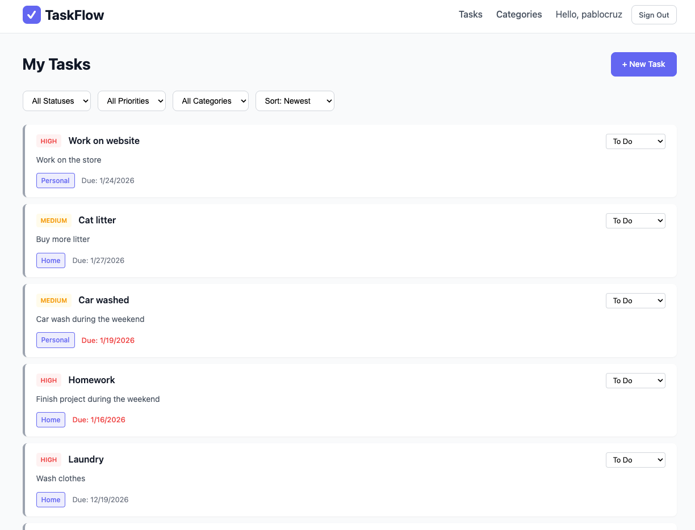

# ✅ TaskFlow

A full-stack task management application that helps users organize their work with categories, priorities, and due dates.

![TaskFlow Screenshot]

## Description

TaskFlow is a productivity app built to help users manage their daily tasks efficiently. Users can create tasks with priority levels (high, medium, low), set due dates, organize tasks into color-coded categories, and track progress with status updates (to-do, in-progress, done).

**Why I built this:** I wanted to create a practical tool that solves a real problem - staying organized. This project also allowed me to demonstrate full CRUD functionality with user authentication in a MEN stack application.

## Getting Started

🚀 **[Live App](https://the-task-flow-app-064a21a03f83.herokuapp.com/)**

📋 **[Planning Materials (Trello)](https://trello.com/b/Bo9lD2bC/taskmanager-app)**

### Features
- User authentication (sign up, sign in, sign out)
- Create, read, update, and delete tasks
- Organize tasks with custom categories
- Set priority levels and due dates
- Track task status
- Flash messages for user feedback

## Technologies Used

- **Backend:** Node.js, Express.js
- **Database:** MongoDB, Mongoose
- **Templating:** EJS
- **Authentication:** bcrypt, express-session
- **Styling:** CSS3 (Flexbox & Grid)
- **Deployment:** Heroku, MongoDB Atlas

## Next Steps

Future enhancements planned for TaskFlow:

- [ ] Drag and drop tasks between status columns
- [ ] Dark mode toggle
- [ ] Email reminders for upcoming due dates
- [ ] Task search and filtering
- [ ] Recurring tasks
- [ ] Mobile app version
